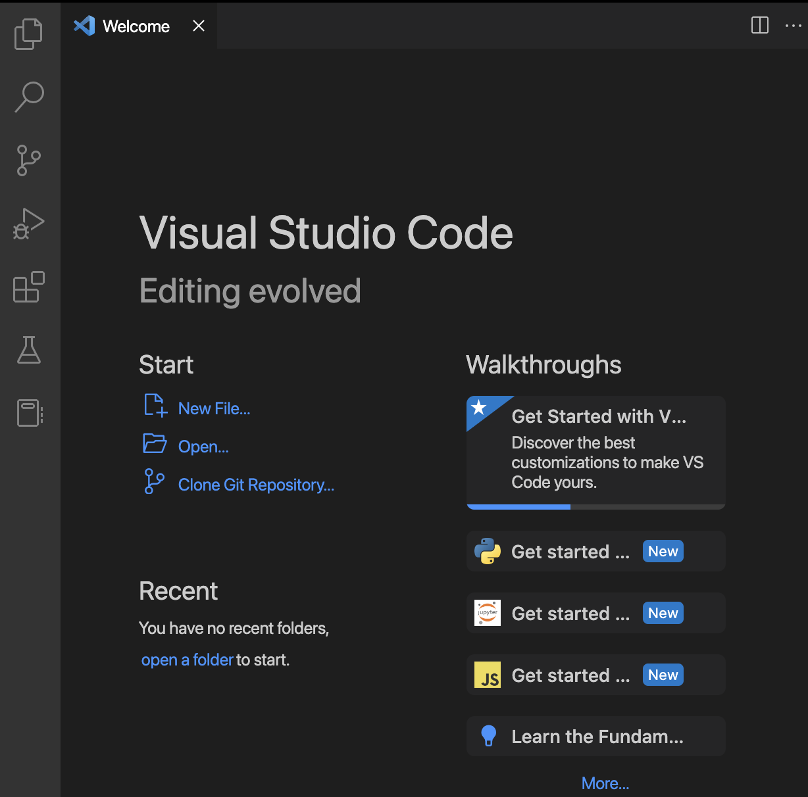

# Objectif
Apprendre à écrire et exécuter ton premier programme Python en utilisant "***Visual Studio Code***" et ce que tu as appris sur le fonctionnement d'un "***Terminal Linux***".

# Programmer avec "*Visual Studio Code*"
1. Pour commencer, cherche l'application "*Visual Studio Code*" sur ton "*Bureau*" ("*Desktop*" en anglais) et lance-la.
> Une fenêtre s'ouvre avec 2 parties principales:
> - celle de gauche: c'est là qu'on va écrire/éditer le programme
> - celle de droite: ton fameux "***Terminal Linux***" où tu peux lancer les mêmes commandes que tu as apprises précédemment.

2. Dans la partie "***Terminal***" de l'application, déplace-toi dans ton répertoire de travail [a compléter] avec les bonnes commandes.

3. Crée un nouveau repertoire avec le nom "ApprendrePython"

4. Place-toi dans ce nouveau repertoire et verifie s'il est vide (j'espère que tu te souviens de la bonne commande à lancer pour cela :P )

5. Regarde maintenant sur la partie de gauche et ouvre le répertoire "ApprendrePython" que tu viens de créer.

> Astuce: Clique sur l'icône tout en haut à gauche si tu n'a plus la page de bienvenue

6. Trouve le moyen de créer un nouveau fichier que tu nommera "hello_world.py"

7. Dans ton "Terminal" lance la commande 
`ls -l` 
pour voir ce qu'il s'est passé.

8. Toujours dans ton "Terminal", lance la commande:
 `python3 hello_world.py` 
 Qu'observes tu ?

9. Dans la partie de gauche, tu visualises normalement le contenu du fichier "hello_world.py" que tu as créé et qui devrait être vide. Maintenant ecrit le code suivant dans le fichier:
`print("Hello World!")`
Sauvegarde le fichier (raccourci clavier: `Ctrl + S`)

10. Dans ton "*Terminal*", relance de nouveau la commande :
`python3 hello_world.py`  
Qu'observes-tu cette fois-ci ? 

11. Observe le code dans la partie gauche et essaye de le modifier pour qu'il affiche le message suivant:
`Youpi! J'ai réussi à écrire et lancer mon premier programme en Python`

12. Sauvegarde tes modifications et lance ton programme de nouveau:
`python3 hello_world.py`
> Attention: Bien penser à sauvegarder ton fichier qui contient le code avant de l'executer avec l'*interpreteur de code* python3

