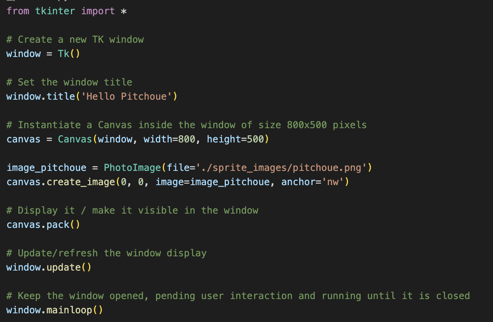

# Un peu de couleur et d'animation

## Un peu d'amusement avec Pitchoue
Bonjour, je m'appelle Pitchoue. Je te propose de jouer avec moi tout en apprenant à programmer en Python. Alors, tu te demandes qui je suis, à quoi ou à qui je ressemble et qu'est-ce que je sais faire, n'est-ce pas ?
Eh bien, un peu de patience car c'est toi qui va me créer en tant que programme :).
Pour cela, suis bien les étapes suivantes:

## Creation de mon espace
Comme tu as dû t'en douter, je suis un personnage et pour exister il me faut un monde (un espace) dans lequel je peux me situer, être visible et évoluer. Pour cela, on va utiliser la bibliothèque graphique de Python qui permet de créer facilement cet espace.

1) Ouvre ton IDE "*Visual Studio Code*" (j'espere que tu te souviens c'est quoi un IDE et comment faire... autrement rejette un oeil sur le précédent tutoriel) 
2) Dans ton IDE, ouvre ton répertoire `/home/chase/ApprendreInformatique/ApprendrePython`
3) Crée un nouveau fichier `hello_pitchoue.py`
4) Ecris le programme suivant et exécute-le:

> Comme tu peux le voir dans le programme ci-dessus 
> - "Importe" la bibliothèque graphique tkinter (ligne 1)
> - Créer (on dit "instancie") une fenêtre en appelant ce qu'on appelle un "constructeur d'objet" `Tk()` à la ligne 4 et stocke dans une variable `window`
> - Active la fenêtre créée en attente d'interaction de l'utilisateur `mainlopp()`
> La fenêtre créée devrait ressembler a la suivante:

La fenêtre que tu vois n'est pas très interessante puisque le titre "tk" ne veux rien dire. Mais ceci être configuré en programmation.

Une fenêtre `Tk` est ce que l'on appelle une "Classe" python. Autrement dit, c'est un type d'objet qui possède ce que l'on appelle des `attributs` qui peuvent contenir des valeurs qui lui sont propres et que l'on peut spécifier. 
Par exemple ici le `titre` de la fenêtre est un attribut et on peut le donner un autre nom que `tk` qui est celui par défaut comme ci-dessous:

> Tu peux t'amuser à lui donner le titre que tu veux

Pour que je puisse exister, il me faut une `toile` comme quand on fait un dessin ou une peinture (la `fenêtre` etant le cadre d'un tableau). Dans la bibliothèque graphique de Python, cela s'appelle un `Canvas`.

> - ligne 10: On appelle le `constructeur` de la `Classe` Canvas de la bibliothèque `tkinter` pour créer un objet Canvas `canvas`
> On peut directement spécifier la valeur de certains attributs dans le constructeur de la classe comme par exemple ici la taille de la `toile` : 800 pixels de large et 500 pixels de hauteur. Pour rappel, les tailles d'affichage sur un ecran se mesurent en `pixel`.
> - ligne 13: On appelle la `méthode` `pack()` de la classe Canvas qui permet de le rendre visible dans la fenêtre `window`. Une "Classe" se définit donc par 2 types d'éléments qui la constitue: ses `attributs` et ses `methodes`.

## J'existe enfin dans mon espace ! :)

Maintenant que ma `toile` est prête, je peux enfin exister et tu pourras enfin me voir!
Pour cela, récupère mon image sur la Freebox dans le répertoire suivant:
`Disque dur/Tutoriels Python/Images/pitchoue.png`

Copie-le dans un nouveau répertoire `sprite_images`. Le fichier pitchoue.png doit être dans le répertoire suivant:
`/home/chase/ApprendreInformatique/ApprendrePython/sprite_images/` 

Une fois tout cela fait, il faut me créer dans le programme python comme suit:

> - ligne 12: On charge l'image dans le programme et dans la variable `image_pitchoue`
> - ligne 13: On ajoute l'image créée en appelant la `méthode` "`create_image()`" de la Classe Canvas en spécifiant respectivement entre parenthèse sa position sur la `toile` (absisse=0 et ordonnée=0), son image et son ancrage `nw` (north west).
> Les coordonnées d'une position sur une `toile` sont definis par le nombre de pixels en absisse et en ordonnée en partant du coin supérieur gauche de la toile:
> 

Me voici! Me voilà! 

## Es-tu prêt pour les Challenges ? 

### Challenge 1: Hello, my name is Pitchoue
Avec ce que tu as appris, essaye de rajouter une bulle et du texte sur la `toile` (Canvas) comme ci-dessous:

Pour cela, tu trouveras l'image de la bulle sur la Freebox dans le répertoire suivant:
`Disque dur/Tutoriels Python/Images/speech_bubble_1.png`

> Indices:
> - Il faudra que tu apprennes à me repositionner sur la `toile` avec les 2 premiers parametres qui correspondent à l'absisse x et l'ordonnée y (0, 0):
>  `canvas.create_image(0, 0, image=image_pitchoue, anchor='nw')`
> - Pour ajouter la bulle sur le Canvas, il faut procéder de la meme manière que tu m'as rajouté dessus
> - Pour ajouter un "élément" ("item" en anglais) sur la `toile` (canvas), il faut utiliser l'élément  
> `text` de facon similaire que l'élément `image` comme l'exemple ci-dessous:
> `canvas.create_text(380, 100, text='Ecrire le texte souhaité ici', fill='black', anchor='nw')`

### Challenge 2: What is your name ?
(en cours de preparaton)

### Challenge 3: Make me a bit smart 
()"en cours de preparaton)

### Challenge 4: Make me even smarter
(en cours de preparaton)

